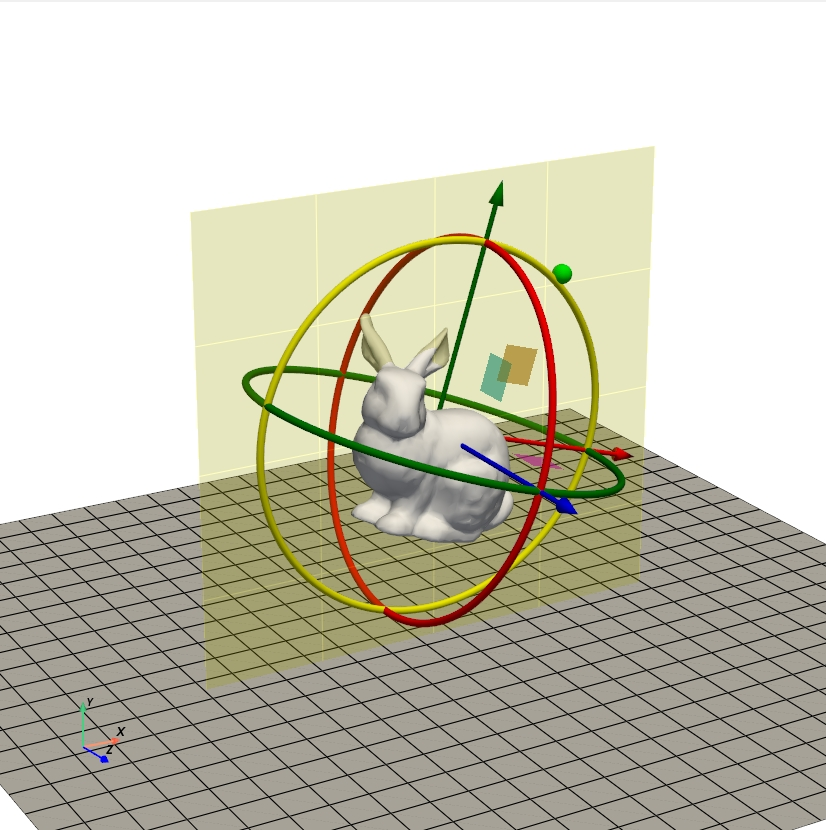

# 3D Transformation Widgets in Python

This project is an implementation of a reusable 3D transformation widget in Python.



### Installation
The repo is developed and tested under Python 3.10.
```
pip install PyQt5
pip install pyvista[all]
pip install pyvistaqt
pip install numpy==1.23
```


### Run
```
python main.py
```
To also show what's going on under the hook:
```
python main.py --verbose
```

### References
BIER, Eric Allan. Skitters and jacks: interactive 3D positioning tools. In: Proceedings of the 1986 workshop on Interactive 3D graphics. 1987. p. 183-196.

[qt3d-gizmo in C++](https://github.com/florianblume/qt3d-gizmo)